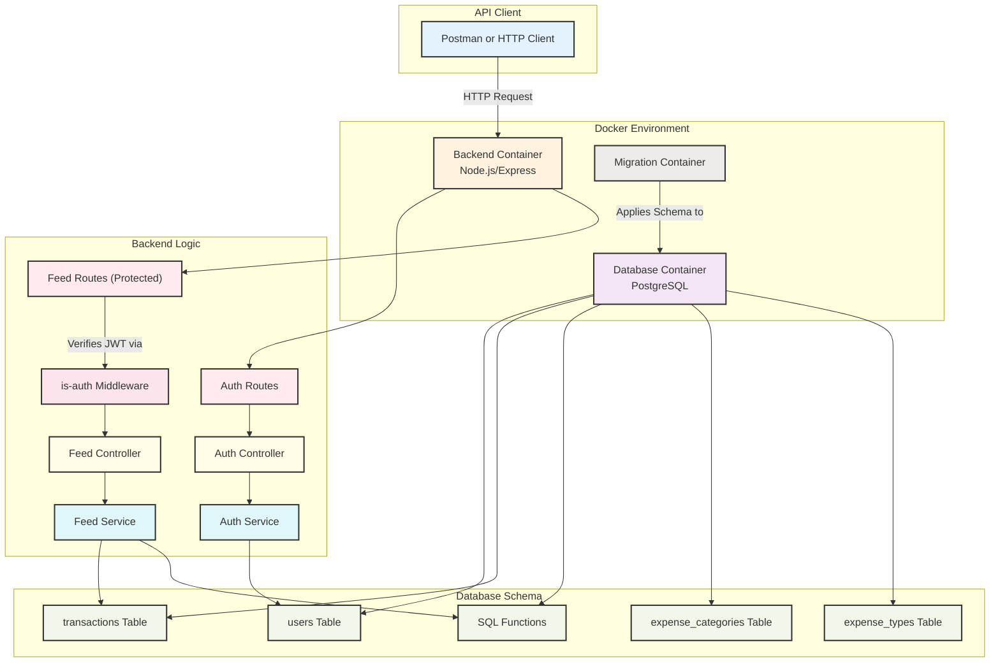
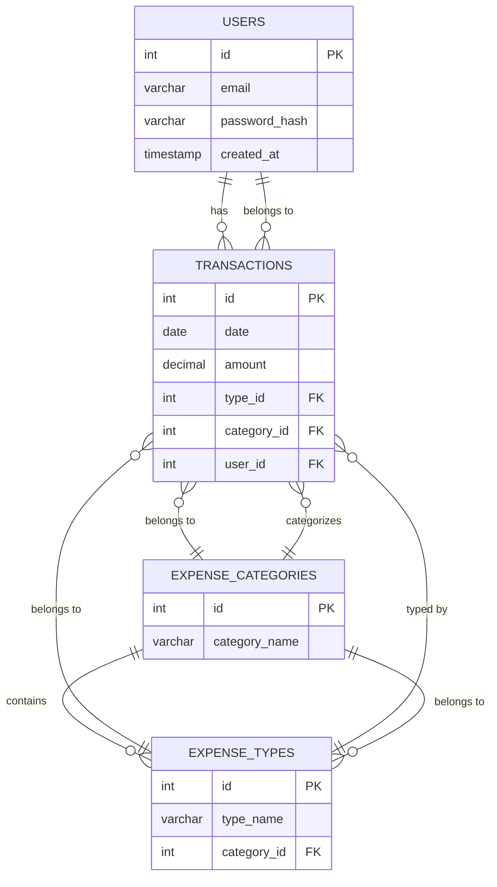

# Personal Finance Tracker

A backend, containerized personal finance management API built with Node.js/Express, TypeScript, PostgreSQL, and Docker Compose.

---

## Backend API Build & Usage

### Prerequisites
- Node.js (v14 or higher recommended)
- npm
- PostgreSQL (running locally or accessible remotely)

### 1. Clone the repository
```sh
git clone <repo-url>
cd finance-tracker/backend
```

### 2. Configure Environment Variables
Create a `.env` file in the `backend` directory with the following content:
```
POSTGRES_USER=your_db_user
POSTGRES_PASSWORD=your_db_password
POSTGRES_HOST=localhost
POSTGRES_DB=tracker
PORT=8000
JWT_SECRET=your_super_secret_key
```
Replace the values as needed for your setup.

### 3. Install Dependencies
```sh
npm install
```

### 4. Build the Backend
```sh
npm run build
```

### 5. Run Database Migrations
Go to the `database` directory and run:
```sh
cd ../database
npm install
npm run build
node dist/runMigrations.js up
```

### 6. Start the Backend API
Return to the backend directory and run:
```sh
cd ../backend
npm run start:prod
```
The API will be available at `http://localhost:8000` (or the port you set).

---

## Table of Contents

- [Overview](#overview)
- [Features](#features)
- [System Architecture](#system-architecture)
- [Data Model](#data-model)
- [API Documentation](#api-documentation)
- [Credits & Resources](#credits--resources)

---

## Overview

This project is a robust, user-friendly API for tracking personal finances. Secure authentication and insightful analytics. All components are containerized for easy deployment.

**Motivation:**

- Consolidate financial tracking into a single, efficient platform.
- Learn and apply best practices in backend development, security, and DevOps.

## Features

- **User Authentication:** Secure signup/login with JWT and password hashing.
- **User-specific Data:** Each user's data is isolated and protected.
- **Expense & Income Tracking:** Add, view, and categorize transactions.
- **REST API:** Clean separation between backend and database.
- **Dockerized:** One-command setup for local or production.

---

## System Architecture



---

## Data Model

### Entity-Relationship Diagram



**Table Descriptions:**

- **users:** Stores user credentials and metadata. Each user has a unique email and securely hashed password.
- **transactions:** Records all income/expenses. Each transaction is linked to a user, a category, and a type.
- **expense_categories:** High-level groupings (e.g., Housing, Personal Running Costs).
- **expense_types:** Specific types within a category (e.g., Restaurants, Groceries).

---

## API Documentation

### Authentication

Most endpoints require a JWT token. After logging in, include the token in the `Authorization` header as:

```
Authorization: Bearer <token>
```

### Endpoints

#### **Auth**

- **POST /auth/signup**

  - Register a new user.
  - Request body (JSON):
    ```json
    {
      "email": "user@example.com",
      "password": "yourpassword"
    }
    ```
  - Response:
    - `201 Created` on success:
      ```json
      { "message": "User created successfully!", "user": { ... } }
      ```
    - `409 Conflict` if email exists.

- **POST /auth/login**
  - Log in and receive a JWT token.
  - Request body (JSON):
    ```json
    {
      "email": "user@example.com",
      "password": "yourpassword"
    }
    ```
  - Response:
    - `200 OK` on success:
      ```json
      { "token": "<JWT>", "userId": 1 }
      ```
    - `401 Unauthorized` if credentials are invalid.

---

#### **Feed (Protected, requires JWT)**

- **GET /feed/expense-categories**

  - Get all expense categories.
  - Response: Array of categories.

- **POST /feed/transaction**

  - Create a new transaction.
  - Request body (JSON):
    ```json
    {
      "date": "2024-07-17",
      "amount": 100.5,
      "typeId": 1,
      "categoryId": 2
    }
    ```
  - Response:
    - `201 Created`:
      ```json
      { "message": "Transaction created successfully!", "transaction": { ... } }
      ```

- **GET /feed/timeseries**

  - Get time series data for the authenticated user.
  - Response: Array of time series data.

- **GET /feed/income-expenses**

  - Get income and expenses for the authenticated user.
  - Response: Array of income/expense data.

- **GET /feed/casflow**

  - Get cashflow data for the authenticated user.
  - Response: Array of cashflow data.

- **GET /feed/financial-overview**

  - Get a financial overview for the authenticated user.
  - Response: Array of overview data.

- **GET /feed/financial-details**

  - Get detailed financial data for the authenticated user.
  - Response: Array of details.

- **GET /feed/list-expenses**
  - Get a table of expenses per month for the authenticated user.
  - Response: Array of expense table data.

---

### Example: Using Authorization Header

For protected endpoints, add this header:

```
Authorization: Bearer <your_token>
```

### Error Responses

- `401 Unauthorized`: Not authenticated or invalid token.
- `422 Unprocessable Entity`: Validation failed.
- `409 Conflict`: Resource already exists.
- `500 Internal Server Error`: Server error.

---
